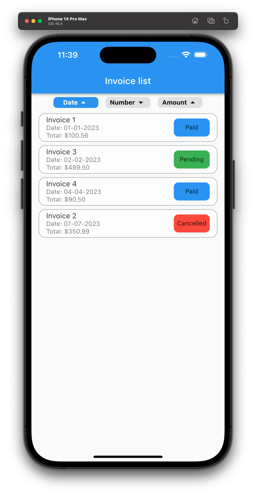

# Flutter Bloc State management with Freezed + Flutter

Before we begin and cut the meat, it is important to clarify what Freezed is and why it is advisable to use it in your projects.

## What is and why use Freezed?

Freezed is a Dart library that is used to automatically generate immutable classes (classes that cannot be modified after creation), as well as sealed classes. And you might say, I have no idea what either is, ok. Don't panic. It will be briefly explained in this article. 

### Sealed classes with Freezed.

Sealed classes are those that have a limited set of known subclasses at compile time. And what does that mean, right?

Imagine you want to create a class that represents the types of errors you have in your application. Without the Freezed package it could be something like this:

```dart
abstract class AppError {
  const AppError();
}
class NetworkError extends AppError {
  const NetworkError();
}
class ServerError extends AppError {
  final int statusCode;
  final String message;

  const ServerError({required this.statusCode, required this.message});
}
class AuthError extends AppError {
  const AuthError();
}
```

And now, let’s do it with Freezed, you’ll notice the difference. 

```dart
@freezed
class AppError with _$AppError {
  const factory AppError.network() = NetworkError;
  const factory AppError.server({required int statusCode, required String message}) = ServerError;
  const factory AppError.auth() = AuthError;
}
```

### Object creation with Freezed

As for creating objects, Freezed also offers some interesting advantages:

1. **Immutability:** By generating immutable classes, the objects that are created cannot be modified after creation, ensuring that the object's state remains constant at all times.
2. **Explicit constructors:** Freezed generates explicit constructors for all the classes it creates, making object creation easier and clearer.
3. **Serialization ease:** Freezed offers the ability to easily serialize sealed class objects and immutable class objects. This is useful when objects need to be transmitted over a network or stored in a database.

Ok, let’s show an example and let’s say that you are building an app for a restaurant that want to handle their invoices, so you need to create an invoice class. 

```dart
@freezed
class Invoice with _$Invoice {
  const factory Invoice({
    required DateTime registryDate, // ===> Date of registration
    required String number, // ====> Invoice number
    required double amount, // ===> Total of the invoice
    required InvoiceStatus status, // Invoice status
  }) = _Invoice;
}
```

To modify our objects, we could do so through copywith() constructors, which returns a new instance of the object we already had but modified with the new values that we pass to it (we will see more examples later), which is automatically generated below without the need to write it by hand, along with other interesting methods. The main ones to consider and that we can reach to auto-generate are:

1. **`toString()`**: returns a string representation of the class instance.
2. **`copyWith()`**: returns a copy of the current instance with one or more fields updated.
3. **`hashCode`**: returns a unique hash value for the current instance.
4. **`operator ==`**: overrides the equality operator to compare two class instances. (No need to use equatable)
5. **`toJson()`**: converts the class instance to a JSON map.
6. **`fromJson()`**: converts a JSON map to a class instance.
7. **`map()`**: applies a function to each field of the instance and returns a new instance with the results.
8. **`maybeMap()`**: applies a function to each field of the instance if the type matches and returns a new instance with the results.
9. **`when()`**: runs a function that matches the type of the current instance.
10. **`maybeWhen()`**: runs a function that matches the type of the current instance if it is present.
11. **`fold()`**: runs a function that matches the type of the current instance and returns a value.
12. **`maybeFold()`**: runs a function that matches the type of the current instance if it is present and returns a value.
13. **`runtimeType`**: returns the runtime type of the current instance.

### Code generation

To generate all these methods, we have to write a small header at the beginning of our class, which will be formed by the word part + the name of the file + freezed + dart. It is important to remember that we should only have one freezed class per file. For example, for our Invoice class, assuming that our file is called invoice.dart. The header would look like this:

```dart
part 'invoice.freezed.dart' // ==> Where our code will be generated

@freezed
class Invoice with _$Invoice {
	...
}
```

Once we have it, we will run our command on our favorite terminal.

```
flutter pub run build_runner build --delete-conflicting-outputs

```

And our file with our methods will magically show up and will be accessible.

# State management with Freezed + bloc.

Alright, it’s time to start with our project. In this small example we are going to suppose that we are building an application with which we can filter invoices. We are going to be able to do it by date, number and quantity. We are also going to be able to change the order, ascending or descending. A dummy implementation could be as follows:




But before grabbing the building tools, why don’t we go back and review how blocs works and what we really need?

### How does bloc work?

The Bloc pattern is used to separate business logic from the user interface. It consists of three main elements:

**The state** (**`State`**). Class that represents the state of our UI.

**The event** (**`Event`**). Class where we will put the possible events launched that can change our state.

**The bloc** (**`Bloc`**). Class that maps the events launched to a new state.

Okay. We're not going to go into a lot of detail right now about how to build, provide or listen to the bloc state from the UI because an example will be shown later. Just bear with me now and let’s go step by step and let’s start with the state class

## State Class

Alright, So, what do we need in our state? Keep in mind that there are a lot of ways of doing the exact same thing, and every developer is going to tell you that his way is the better. So, let’s just do it shall we?

The first thing we need to think about is the filter, we are going to need a class that holds the state of our filters. A possible implementation could be something like this:

```dart
@freezed
class InvoiceOrder with _$InvoiceOrder {
  /// Creates a new instance of [InvoiceOrder] with the specified parameters.
  const factory InvoiceOrder(
      {required FilterOrder filterOrder,
      required bool selected,
      required String name}) = _InvoiceOrder;
}
```

If you're as clever as a fox, you're probably wondering right now. Hey, what's FilterOrder? Excellent question my dear reader. Our order can be ascending or descending...then, another perfect solution would be..yep, you guessed it ! Sealed class!!

```dart
@freezed
class FilterOrder with _$FilterOrder {
/// Represents an ascendant order
const factory FilterOrder.orderAsc() = _OrderAsc;

/// Represents an descendant order
const factory FilterOrder.orderDesc() = _OrderDesc;
}
```

Ok, we have covered already the sort filters but we are missing to key componentes in the state, our list of invoices and also we are going to add some flavour to the business, we are going to assume that every time we change the filter, an API request is done. So, we need to represent when the screen is loading for changes, therefore we need a class that represent this status. One possible implementation could be:

```dart
@freezed
class ScreenStatus with _$ScreenStatus {

	const factory ScreenStatus.initial() = _Initial;

  const factory ScreenStatus.loading() = _Loading;

  const factory ScreenStatus.success() = _Success;

  const factory ScreenStatus.error() = _Error; // We could add here the error class as parameter if we wanted. We don't right now. 

}
```

Ok. We already have everything we need to set up our state class:

- Invoice class that holds every data that our invoice will have.
- Our class that represents the order in which they will be displayed.
- Our class that represents the state of the screen

### 

### State class

Recap, we already know the elements our state class needs to have, let's set it up. One possible implementation would be:

```dart
@freezed
class InvoiceFilterState with _$InvoiceFilterState {
  const factory InvoiceFilterState({
    required InvoiceDataFilter invoiceDataFilter,
    required ScreenStatus screenStatus,
		required List<Invoices> invoicesList, 
  }) = _FilterState;

  factory InvoiceFilterState.initial() {
    return InvoiceFilterState(
      invoiceDataFilter: InvoiceDataFilter.date(FilterOrder.orderAsc()),
      screenStatus: ScreenStatus.initial(),
			invoicesList: [], 
    );
  }
}
```

### Event class

We have to ask ourselves what events we will need, which will change our state. In our case let's assume we have a button to reset our filters. This way we would have two possible events. One for when we press clear button and reset our filter to initial (date) and another event that will be responsible for setting the selected filter. This way we have:

```dart
@freezed
class InvoiceFilterEvent with _$InvoiceFilterEvent {

const factory InvoiceFilterEvent.updateInvoiceDataFilter(InvoiceDataFilter invoiceDataFilter) = _UpdateInvoiceDataFilter;

const factory InvoiceFilterEvent.resetAllFilters() = _ResetAllFilters;

}
```

So far we have 2 of the 3 necessary classes.

The event (**`Event`**).  ✅

The state (**`State`**).   ✅

The bloc (**`Bloc`**). 🚨

### Bloc class

To give it a little more flavor and add some asynchrony, let's assume that when we set our filter through the filter buttons, we call an external service through a repository, which will give us an asynchronous response with a list of invoices. 

The repository will be given by parameter in the creation of the bloc, which is not the subject of our study today.  A possible implementation of this class could be:

```dart
class InvoiceFilterBloc extends Bloc<InvoiceFilterEvent, InvoiceFilterState> {
	final RepositoryContract _repository;	

// We set the initial state to InvoiceFilterState.initial() where we set everything to an initial status. 
  InvoiceFilterBloc({
		required FaceRepositoryContract repository,
	}) : _repository = repository, 
		
	super(InvoiceFilterState.initial()) {
		
    on<InvoiceFilterEvent>(
      (event, emit) async {

        await event.when(  // This .when force us to map every possible event

         updateInvoiceDataFilter: (invoiceDataFilter) async {
            await _onupdateInvoiceDataFilter(event, emit, invoiceDataFilter);
          },

					//For simplicity, we show the example like this without calling any service here.
					//Depenging on our logic we could clear the invoices too. 
	        resetAllFilters: () {
            emit(
              state.copyWith(
	               invoiceDataFilter: InvoiceDataFilter.date(FilterOrder.orderAsc()),
              ),
            );
          },
        );
      },
    );
  }

	FutureOr<void> _onupdateInvoiceDataFilter(
	    InvoiceFilterEvent event,
	    Emitter<InvoiceFilterState> emit,
	    InvoiceDataFilter invoiceDataFilter,
	  ) async {

	    emit(
	      state.copyWith(
	        screenStatus: const ScreenStatus.loading(),
	      ),
	    );

			//Fake call.
			final result = await _repository.getFilteredInvoices(invoiceDataFilter);

			result.when(
		      failure: (failure) {
		        emit(
		          state.copyWith(
		            screenStatus: const ScreenStatus.error(),
		          ),
		        );
		      },
		      success: (invoices) {
		        emit(
		          state.copyWith(
		            screenStatus: const ScreenStatus.success(),
								invoicesList: invoices
		          ),
		        );
		      },
		    );
	  }
}

```

And that's it. Our bloc is complete.

The event (**`Event`**).  ✅

The state (**`State`**).   ✅

The bloc (**`Bloc`**).  ✅

### What are the main advantages of doing it this way?

**Advantage n1** ⇒ Security. By using the word **`when`** for our events in bloc, it forces us to have to transform that event into a state. And not only that, by adding an event to our class and generating the code, the bloc class will automatically force us to convert our event into a new state.

**Advantage n2 ⇒** Our code is more understandable. Easier to read for someone who takes your code five months from now! and keep in mind that person can be you.

**Advantage n3 ⇒** All the methods that come already generated by Freezed and that have been mentioned before.

## Using bloc from the UI

To use bloc from the UI, we can create a `BlocProvider` and a `BlocBuilder`. The `BlocProvider` creates the bloc and provides it to the descendants of the widget tree. The `BlocBuilder` allows us to listen to state changes from the bloc and rebuild the UI accordingly.

One possible use could be the following. Imagine that when the invoices are filtered you want to show the list of invoices, when it is loading a loading widget, and when it is not, simply the filters menu. One possible implementation would be:

```dart
class CreateIncidenceContactMessageHandler extends StatelessWidget {
  const CreateIncidenceContactMessageHandler({Key? key}) : super(key: key);

  @override
  Widget build(BuildContext context) {

    return BlocProvider(
      create: (context) => InvoiceFilterBloc(repository: GetIt.I<RepositoryContract>()), // Creation of the bloc
      child: BlocBuilder<InvoiceFilterBloc, InvoiceFilterState>( // Consuming the bloc
        builder: (context, state) {
          return state.screenStatus.when(
            initial: () => FilterInvoicesPage(),
            loading: () => LoadingWidget(),
            success: () => InvoicesList(invoices: state.invoicesList),
            error: () => ErrorWidget(),
          );
        },
      ),
    );
  }
}

// Just an example..
```

### Example of launching an event from a widget.

To launch an event from a widget, we can use the `context.read<BlocType>().add(Event())` method. To continue with the example:

```dart
class FilterInvoicesPage extends StatelessWidget {

  @override
  Widget build(BuildContext context) {
    final _bloc = context.read<InvoiceFilterBloc>(); // as long as it is descendant of a provided bloc, it is ok. 

    return GestureDetector(
      onTap: ()=> _bloc.add(InvoiceFilterEvent.updateInvoiceDataFilter(InvoiceDataFilter.number(FilterOrder.OrderAsc())
      child: Text('I should have studied medicine'),
    );
  }
}
```

### Last advices

Before leaving I wanted to leave a couple of  tips.

- When you are working with this type of packages that require generated code it is very convenient that the generator is activated at all times. This will save us to be launching it every 3 minutes from the terminal. To have it activated at all times just launch this command

```dart
flutter pub run build_runner watch --delete-conflicting-outputs
```

- Go class by class generating code. Do not do all 3 at once because some will depend on others and you will have a hard time finding the bug.
- Get up every hour and stretch. This has nothing to do but I felt like it.

👋👋👋👋