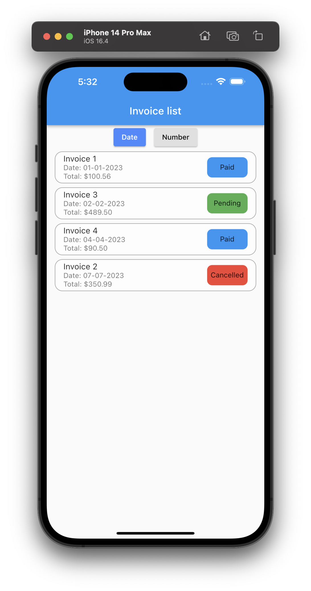

# Flutter Bloc State management with Freezed + Flutter

Before we begin and cut the meat, it is important to clarify what Freezed is and why it is advisable to use it in your projects.

## What is and why use Freezed?

Freezed is a Dart library that is used to automatically generate immutable classes (classes that cannot be modified after creation), as well as sealed classes. And you might say, I have no idea what either is, ok. Don't panic. It will be briefly explained in this article. 

### Sealed classes with Freezed.

Sealed classes are those that have a limited set of known subclasses at compile time. And what does that mean, right?

Imagine you want to create a class that represents the types of errors you have in your application. Without the Freezed package it could be something like this:

```dart
abstract class AppError {
  const AppError();
}
class NetworkError extends AppError {
  const NetworkError();
}
class ServerError extends AppError {
  final int statusCode;
  final String message;

  const ServerError({required this.statusCode, required this.message});
}
class AuthError extends AppError {
  const AuthError();
}
```

And now, let’s do it with Freezed, you’ll notice the difference. 

```dart
@freezed
class AppError with _$AppError {
  const factory AppError.network() = NetworkError;
  const factory AppError.server({required int statusCode, required String message}) = ServerError;
  const factory AppError.auth() = AuthError;
}
```

### Object creation with Freezed

As for creating objects, Freezed also offers some interesting advantages:

1. **Immutability:** By generating immutable classes, the objects that are created cannot be modified after creation, ensuring that the object's state remains constant at all times.
2. **Explicit constructors:** Freezed generates explicit constructors for all the classes it creates, making object creation easier and clearer.
3. **Serialization ease:** Freezed offers the ability to easily serialize sealed class objects and immutable class objects. This is useful when objects need to be transmitted over a network or stored in a database.

Ok, let’s show an example and let’s say that you are building an app for a restaurant that want to handle their invoices, so you need to create an invoice class. 

```dart
@freezed
class Invoice with _$Invoice {
  const factory Invoice({
    required DateTime registryDate, // ===> Date of registration
    required String number, // ====> Invoice number
    required double amount, // ===> Total of the invoice
    required InvoiceStatus status, // Invoice status
  }) = _Invoice;
}
```

To modify our objects, we could do so through copywith() constructors, which returns a new instance of the object we already had but modified with the new values that we pass to it (we will see more examples later), which is automatically generated below without the need to write it by hand, along with other interesting methods. The main ones to consider and that we can reach to auto-generate are:

1. **`toString()`**: returns a string representation of the class instance.
2. **`copyWith()`**: returns a copy of the current instance with one or more fields updated.
3. **`hashCode`**: returns a unique hash value for the current instance.
4. **`operator ==`**: overrides the equality operator to compare two class instances. (No need to use equatable)
5. **`toJson()`**: converts the class instance to a JSON map.
6. **`fromJson()`**: converts a JSON map to a class instance.
7. **`map()`**: applies a function to each field of the instance and returns a new instance with the results.
8. **`maybeMap()`**: applies a function to each field of the instance if the type matches and returns a new instance with the results.
9. **`when()`**: runs a function that matches the type of the current instance.
10. **`maybeWhen()`**: runs a function that matches the type of the current instance if it is present.
11. **`fold()`**: runs a function that matches the type of the current instance and returns a value.
12. **`maybeFold()`**: runs a function that matches the type of the current instance if it is present and returns a value.
13. **`runtimeType`**: returns the runtime type of the current instance.

### Code generation

To generate all these methods, we have to write a small header at the beginning of our class, which will be formed by the word part + the name of the file + freezed + dart. It is important to remember that we should only have one freezed class per file. For example, for our Invoice class, assuming that our file is called invoice.dart. The header would look like this:

```dart
part 'invoice.freezed.dart' // ==> Where our code will be generated

@freezed
class Invoice with _$Invoice {
	...
}
```

Once we have it, we will run our command on our favorite terminal.

```
flutter pub run build_runner build --delete-conflicting-outputs

```

And our file with our methods will magically show up and will be accessible.

# State management with Freezed + bloc.

Ok, let’s build our small project. There will be two version of the same project, the first one will be simpler and we will complicate it a bit with the second one. 

Let’s imagine that we are building an application with which we can filter invoices, for the first one and for the sake of simplicity, we can sort them by date and number. That’s it, I know I know it’s too easy..but for this one we are going to focus just in how bloc works. We will have time later to complicate our lives.  A dummy UI implementation would. be something like this:




But before grabbing the building tools, why don’t we go back and review how blocs works and what we really need?

### How does bloc work?

The Bloc pattern is used to separate business logic from the user interface. It consists of the following main parts:

**The state** (**`State`**) . Represents the current state of the application. In the Flutter Bloc pattern, the State is usually defined as an immutable class. It contains all the data needed to render the UI for a given screen or widget. When the State changes, the UI is rebuilt to reflect the new state. The State class should be designed to be as simple and efficient as possible, to ensure that the UI can be updated quickly and smoothly.

**The event** (**`Event`**). Represents an action or input that triggers a change in the application state. In the Flutter Bloc pattern, the Event is also usually defined as an immutable class. Events are sent to the Bloc, which processes them and updates the State accordingly. Events can be triggered by user interactions, such as button presses or text input, or by external factors, such as changes in data from a server

**The bloc** (**`Bloc`**).  Responsible for managing the State of the application in response to Events. It receives Events and processes them to update the State, which is then sent to the UI to be rendered. The Bloc is usually a generic class that takes an Event and a State as its type parameters. It contains the business logic that processes Events and updates the State. The Bloc should be designed to be as modular as possible, with each Bloc responsible for a specific feature or functionality of the application.

**The UI** (**`Widget`**). The UI is the part of the application that the user interacts with. It displays the current State of the application and responds to user input by sending Events to the Bloc. In the Flutter Bloc pattern, the UI is usually implemented using Flutter widgets. Widgets can be designed to be stateful or stateless, depending on whether they need to hold onto any internal state. Stateless widgets are recommended whenever possible, as they are simpler and more efficient.

## State Class

Alright, So, what do we need in our state? Keep in mind that there are a lot of ways of doing the exact same thing, and every developer is going to tell you that his way is the better. So, let’s just do it shall we?

The first thing we need to think about is the filter, we are going to need a class that holds the state of our sort filters. In this first approach we need to differentiate between date and number and just one of them can be used at the same time. So a perfect solution would be a sealed class:

```dart
@freezed
class InvoiceOrder with _$InvoiceOrder {
  const factory InvoiceOrder.date() = _Date;

  const factory InvoiceOrder.number() = _Number;
}
```

Ok, we have covered already the sort filters but we are missing two key componentes in the state, our list of invoices to be displayed  and also we are going to add some flavour to the business, we are going to assume that every time we change the filter, an API request is done. So, we need to represent when the screen is loading for changes, therefore we need a class that represent this status. One possible implementation for this class could be:

```dart
@freezed
class ScreenStatus with _$ScreenStatus {

/// Creates a new instance of [ScreenStatus] with an initial value of [_Initial].
const factory ScreenStatus.initial() = _Initial;

/// Creates a new instance of [ScreenStatus] representing a loading state.
const factory ScreenStatus.loading() = _Loading;

/// Creates a new instance of [ScreenStatus] representing a success state.
const factory ScreenStatus.success() = _Success;

/// Creates a new instance of [ScreenStatus] representing an error state.
const factory ScreenStatus.error() = _Error;
}

/// An extension providing additional methods for [ScreenStatus].
extension ScreenStatusExtension on ScreenStatus {

/// Returns `true` if the [ScreenStatus] is in the loading state; otherwise, returns `false`.
bool isLoading() => maybeWhen(orElse: () => false, loading: () => true);
}
```

Recap, we already know the elements our state class needs to have, let's set it up. One possible implementation would be:

```dart
@freezed
class InvoiceListState with _$InvoiceListState {
  const factory InvoiceListState(
      {required InvoiceOrder invoicesOrderState,
      required List<Invoice> invoiceList,
      required ScreenStatus screenStatus}) = _InvoiceListState;

/// Initial state of the state 
  factory InvoiceListState.initial() {
    return const InvoiceListState(
      invoicesOrderState: InvoiceOrder.date(),
      invoiceList: [],
      screenStatus: ScreenStatus.initial(),
    );
  }
}

```

So, state class completed!! So far we have 1 of the 3 necessary classes.

The event (**`Event`**).  ✅

The state (**`State`**).   🚨

The bloc (**`Bloc`**). 🚨

Let’s jump into the next one.

### Event class

We have to ask ourselves what events we will need, which will change our state. In our case let's assume we have a button to reset our filters. This way we would have two possible events. One for when we press clear button and reset our filter to initial (date) and another event that will be responsible for setting the selected filter. This way we have:

```dart
@freezed
class InvoiceFilterEvent with _$InvoiceFilterEvent {

const factory InvoiceFilterEvent.updateInvoiceDataFilter(InvoiceDataFilter invoiceDataFilter) = _UpdateInvoiceDataFilter;

const factory InvoiceFilterEvent.resetAllFilters() = _ResetAllFilters;

}
```

And that’s it!, quick this one uh! Second step completed.

The event (**`Event`**).  ✅

The state (**`State`**).   ✅

The bloc (**`Bloc`**). 🚨

### Bloc class

To give it a little more flavour and add some asynchrony, let's assume that when we set our filter through the filter buttons, we call an external service through a repository, which will give us an asynchronous response with a list of invoices. 

The repository will be given by parameter in the creation of the bloc, which is not the subject of our study today.  A possible implementation of this class could be:

```dart
class InvoiceListBloc extends Bloc<InvoiceListEvent, InvoiceListState> {
  final MockRepository _repository;

  InvoiceListBloc({required repository})
      : _repository = repository,
        super(InvoiceListState.initial()) {
    on<InvoiceListEvent>(
      (event, emit) async {
        await event.when(
            updatedOrder: (invoiceOrderState) async => await _onUpdatedOrder(event, emit, invoiceOrderState),
            resetFilters: () { emit(InvoiceListState.initial());},
         
      },
    );
  }

FutureOr<void> _onUpdatedOrder(
    InvoiceListEvent event,
    Emitter<InvoiceListState> emit,
    InvoiceOrder invoiceOrderState,
  ) async {
    emit(
      state.copyWith(
          screenStatus: const ScreenStatus.loading(),
          invoicesOrderState: invoiceOrderState),
    );

    final invoiceList = await _repository.getSortedInvoices(invoiceOrderState);

    emit(
      state.copyWith(
          screenStatus: const ScreenStatus.success(), invoiceList: invoiceList),
    );
  }
}
```

And that's it. Our bloc is complete.

The event (**`Event`**).  ✅

The state (**`State`**).   ✅

The bloc (**`Bloc`**).  ✅

### What are the main advantages of doing it this way?

**Advantage n1** ⇒ Security. By using the word **`when`** for our events in bloc, it forces us to have to transform that event into a state. And not only that, by adding an event to our class and generating the code, the bloc class will automatically force us to convert our event into a new state.

**Advantage n2 ⇒** Our code is more understandable. Easier to read for someone who takes your code five months from now! and keep in mind that person can be you.

**Advantage n3 ⇒** All the methods that come already generated by Freezed and that have been mentioned before.

## Using bloc from the UI

To use bloc from the UI, we can create a `BlocProvider` and a `BlocBuilder`. The `BlocProvider` creates the bloc and provides it to the descendants of the widget tree. The `BlocBuilder` allows us to listen to state changes from the bloc and rebuild the UI accordingly.

One possible use could be the following. Imagine that when the invoices are filtered you want to show the list of invoices, when it is loading a loading widget, and when it is not, simply the filters menu. One possible implementation would be:

```dart
class InvoiceListPage extends StatelessWidget {
  const InvoiceListPage({Key? key}) : super(key: key);

  @override
  Widget build(BuildContext context) {
    return BlocProvider(
      create: (BuildContext context) =>
          InvoiceListBloc(repository: MockRepository()),
      child: BlocBuilder<InvoiceListBloc, InvoiceListState>(
          builder: (context, state) {
        final bloc = context.read<InvoiceListBloc>();
        return Scaffold(
          appBar: AppBar(
            title: const Text('Invoice list'),
          ),
          body: state.screenStatus.when(
            initial: () => const InvoiceListSection(),
            loading: () => const Center(child: CircularProgressIndicator()),
            success: () => const InvoiceListSection(),
            error: () => const SizedBox(),
          ),
        );
      }),
    );
  }
}

```

In our case the page is divided in two, the row sort buttons and the list of invoices


```dart
class InvoiceListSection extends StatelessWidget {
  const InvoiceListSection({Key? key}) : super(key: key);

  @override
  Widget build(BuildContext context) {
    return BlocBuilder<InvoiceListBloc, InvoiceListState>(
      builder: (context, state) {
        return Padding(
          padding: const EdgeInsets.symmetric(horizontal: 16.0),
          child: Column(
            children: [
							///
              /// =====> Row buttons
              ///
							SortChipsRow(
                  state: state.invoicesOrderState,
                  onChipSelected: (invoiceOrderState) {
                    context
                        .read<InvoiceListBloc>()
                        .add(InvoiceListEvent.updatedOrder(invoiceOrderState));
                  }),
							///
              /// =====> Invoice List Section
              ///
							Expanded(
                child: ListView.builder(
                  itemCount: state.invoiceList.length,
                  itemBuilder: (context, index) {
                    return InvoiceCard(invoice: state.invoiceList[index]);
                  },
                ),
              ),
            ],
          ),
        );
      },
    );
  }
}
```

As you can see, we pass to the SortChipsRow a function which receives an object of type InvoiceOrderState. With this object we are going to trigger the event to change the state of the bloc, then the BlocBuilder will react with the new changes and the UI will be redrawn. 

### Launching an event from a widget.

To launch an event from a widget, we can use the `context.read<BlocType>().add(Event())` method. To continue with the example:

```dart
class InvoiceListSection extends StatelessWidget {
  const InvoiceListSection({Key? key}) : super(key: key);

  @override
  Widget build(BuildContext context) {
    return BlocBuilder<InvoiceListBloc, InvoiceListState>(
      builder: (context, state) {
        return Padding(
          padding: const EdgeInsets.symmetric(horizontal: 16.0),
          child: Column(
            children: [
              SortChipsRow(
                  state: state.invoicesOrderState,
                  onChipSelected: (invoiceOrderState) {
                    context
                        .read<InvoiceListBloc>()
                        .add(InvoiceListEvent.updatedOrder(invoiceOrderState));
                  }),
              Expanded(
                child: ListView.builder(
                  itemCount: state.invoiceList.length,
                  itemBuilder: (context, index) {
                    return InvoiceCard(invoice: state.invoiceList[index]);
                  },
                ),
              ),
            ],
          ),
        );
      },
    );
  }
}

```

Full code of the project but in this simplified version can be found in [this branch](https://github.com/antOnioOnio/flutter_bloc_example/tree/feature/simplify_version).

## Complicating it a bit

In this example we are going to dive into how to encapsulate objects with Freezed. Let’s assume that we want to be able to change not just the invoice order, but also the direction of it, ascending or descending, also let’s add a new sort filter ⇒ Amount.  


Again, there are 2.39M ways of doing the same thing, in this example the main goal is to show how we can encapsulate objects with freezed so maybe you can find your way out in a similar manner.

Ok, so the first change that we need to do now is our filter object.  Before the only thing that we had was a sealed class displaying two options:

```dart
@freezed
class InvoiceOrder with _$InvoiceOrder {
  const factory InvoiceOrder.date() = _Date;
  const factory InvoiceOrder.number() = _Number;
}
```

But now this is not enough. You may think, ok why don’t just add another one and that’s it. Nop, even though I could do it later we would face some problems to keep the state of the non selected buttons ( I tried…). So, one possible solution  would be:

```dart
@freezed
class InvoiceOrder with _$InvoiceOrder {
  /// Creates a new instance of [InvoiceOrder] with the specified parameters.
  const factory InvoiceOrder(
      {required FilterOrder filterOrder,
      required bool selected,
      required String name}) = _InvoiceOrder;
}
```

If you're as clever as a fox, you're probably wondering right now. Hey, what's FilterOrder? Excellent question my dear reader. Our order can be ascending or descending...then, another perfect solution would be..yep, you guessed it ! Sealed class!!

```dart
@freezed
class FilterOrder with _$FilterOrder {
/// Represents an ascendant order
const factory FilterOrder.orderAsc() = _OrderAsc;

/// Represents an descendant order
const factory FilterOrder.orderDesc() = _OrderDesc;
}
```

Ok, we have our object ready to use…. do we? And the answer is no. Is not ready yet. What we need is a list of this object. And you may say now. So…why don’t you just add a **List<InvoiceOrder>** to the bloc state? And I would say cause we are going to encapsulate it!! 

```dart
@freezed
class InvoiceOrderState with _$InvoiceOrderState {

/// Creates a new instance of [InvoiceOrderState].
  ///
  /// The [listInvoiceOrderState] parameter is a required list of [InvoiceOrder]
  /// objects that represents the order of invoices in the UI.
const factory InvoiceOrderState({
    required List<InvoiceOrder> listInvoiceOrderState,
  }) = _InvoiceOrderState;

/// Creates a new instance of [InvoiceOrderState] with initial values.
  ///
  /// The initial values are:
  /// - A list of three [InvoiceOrder] objects, one for each column in the UI.
  /// - The first [InvoiceOrder] object is selected and sorted by date in ascending order.
  /// - The second and third [InvoiceOrder] objects are not selected and sorted by number and amount
  ///   in ascending order, respectively.
factory InvoiceOrderState.initial() {
    return const InvoiceOrderState(
      listInvoiceOrderState: [
        InvoiceOrder(
          filterOrder: FilterOrder.orderAsc(),
          selected: true,
          name: 'Date',
        ),
        InvoiceOrder(
          filterOrder: FilterOrder.orderAsc(),
          selected: false,
          name: 'Number',
        ),
        InvoiceOrder(
          filterOrder: FilterOrder.orderAsc(),
          selected: false,
          name: 'Amount',
        ),
      ],
    );
  }
}
```

And finally, the updated state class:

```dart
@freezed
class InvoiceListState with _$InvoiceListState {
  const factory InvoiceListState(
      {required InvoiceOrderState invoicesOrderState,
      required List<Invoice> invoiceList,
      required ScreenStatus screenStatus}) = _InvoiceListState;

  factory InvoiceListState.initial() {
    return InvoiceListState(
      invoicesOrderState: InvoiceOrderState.initial(),
      invoiceList: [],
      screenStatus: const ScreenStatus.initial(),
    );
  }
}

```

And that’s it. With that now we are able to draw the state of the widget, keep its state and trigger the necessary  events to change it. Of course there are more added logic to handle it, feel free to check it [in the main branch](https://github.com/antOnioOnio/flutter_bloc_example)

### Last advices

Before leaving I wanted to leave a couple of  tips.

- When you are working with this type of packages that require generated code it is very convenient that the generator is activated at all times. This will save us to be launching it every 3 minutes from the terminal. To have it activated at all times just launch this command

```dart
flutter pub run build_runner watch --delete-conflicting-outputs
```

- Go class by class generating code. Do not do all 3 at once because some will depend on others and you will have a hard time finding the bug.
- Get up every hour and stretch. This has nothing to do but I felt like it.

👋👋👋👋